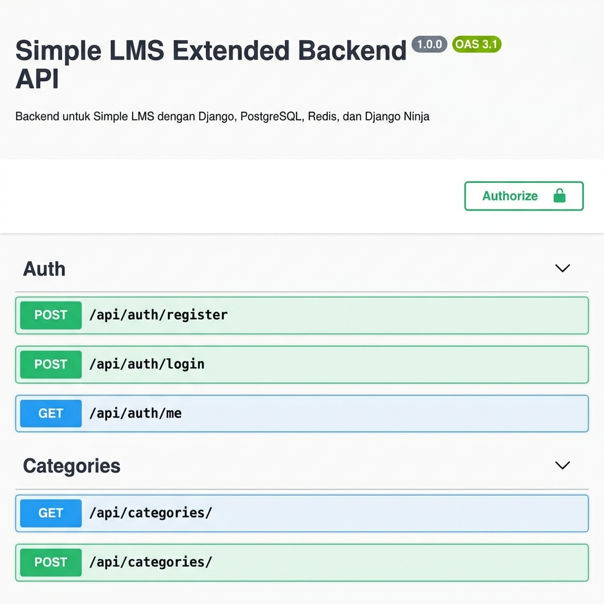

# Simple LMS Extended Backend

Proyek ini adalah **Simple Learning Management System (LMS) Extended Backend** yang dikembangkan menggunakan **Django** dengan **Django Ninja** (REST API), **PostgreSQL** sebagai database utama, dan **Redis** untuk manajemen caching performa tinggi. 

Proyek ini memenuhi standar tugas akhir mata kuliah **Pemrograman Sisi Server (A11.54403)** di Universitas Dian Nuswantoro.

---

## 🚀 Fitur Utama

### 1. Fondasi Proyek (30 Poin)
* **Docker & Docker Compose**: Menjalankan aplikasi web Django, Postgres database, dan Redis secara harmonis.
* **Autentikasi JWT**: Login aman menggunakan token Bearer JWT (`/api/auth/login`).
* **Role-Based Access Control (RBAC)**: Otorisasi khusus untuk 3 Role: **Admin**, **Instructor**, dan **Student**.
* **CRUD Endpoint Dasar**: Endpoint dasar untuk mengelola `Course`, `Lesson`, `Enrollment`, dan `Progress`.
* **Dokumentasi Swagger**: Akses mudah ke OpenAPI interaktif melalui `/api/docs`.

### 2. Fitur Tambahan Pilihan (46 Poin)
* **Permission & Ownership Ketat (12 Poin)**: Pengamanan data di mana Instructor hanya bisa mengelola materi miliknya, dan Student harus terdaftar (*enrolled*) terlebih dahulu untuk membaca materi pelajaran (*lesson*).
* **Search, Filter, & Sorting Lanjutan + Redis Caching (12 Poin)**: Pencarian nama/deskripsi course, penyaringan berdasarkan kategori/instruktur, pengurutan terpopuler/terbaru/rating, serta didukung *caching* list course menggunakan Redis (cache akan dibersihkan secara otomatis jika database berubah).
* **Rating, Review, & Wishlist (12 Poin)**: Student yang terdaftar dapat memberikan ulasan bintang (1-5) & ulasan komentar, serta menyimpan course favorit ke daftar Wishlist.
* **Course Announcement (10 Poin)**: Fitur bagi Instructor untuk membagikan pengumuman penting terkait course kepada para siswa yang terdaftar.

---

## 🛠️ Cara Menjalankan Proyek

### A. Menggunakan Docker Compose (Direkomendasikan)

1. Pastikan Docker Desktop sudah terinstal dan aktif.
2. Buat file `.env` dengan menyalin template dari `.env.example`:
   ```bash
   cp .env.example .env
   ```
3. Jalankan Docker Compose:
   ```bash
   docker compose up --build -d
   ```
4. Jalankan perintah migrasi database dan pengisian data contoh (seed data) di dalam kontainer:
   ```bash
   docker compose exec web python manage.py migrate
   docker compose exec web python manage.py seed_data
   ```
5. Akses dokumentasi API di browser Anda: **[http://127.0.0.1:8000/api/docs](http://127.0.0.1:8000/api/docs)**

---

### B. Menggunakan Environment Lokal (SQLite Fallback)

Jika Anda ingin menjalankan proyek di luar Docker (menggunakan database SQLite lokal):

1. Buat virtual environment python dan pasang dependensi:
   ```bash
   python -m venv venv
   .\venv\Scripts\activate
   pip install -r requirements.txt
   ```
2. Jalankan migrasi database:
   ```bash
   python manage.py makemigrations lms
   python manage.py migrate
   ```
3. Jalankan pengisian data contoh (seeding):
   ```bash
   python manage.py seed_data
   ```
4. Pastikan Redis kontainer aktif di port `6379` untuk fitur caching:
   ```bash
   docker start redis-cache
   ```
5. Jalankan server pembangunan Django:
   ```bash
   python manage.py runserver
   ```
6. Akses dokumentasi API di browser Anda: **[http://127.0.0.1:8000/api/docs](http://127.0.0.1:8000/api/docs)**

---

## 🧪 Cara Menjalankan Pengujian (Tests)

Jalankan perintah berikut pada terminal untuk mengeksekusi automated test suite:
```bash
.\venv\Scripts\python manage.py test lms
```

---

## 👥 Akun Demo Pengujian

Semua akun di bawah di-hash menggunakan password bawaan dari perintah `seed_data`:

| Username | Password | Role | Keterangan |
|---|---|---|---|
| **admin** | `admin123` | **Admin** | Hak akses penuh sistem |
| **instructor1** | `instructor123` | **Instructor** | Memiliki 2 Course contoh & Lesson |
| **student1** | `student123` | **Student** | Sudah terdaftar di Course 1 dan memberikan ulasan |
| **student2** | `student123` | **Student** | Siswa baru belum terdaftar di course mana pun |

---

## 📦 Berkas Deliverables Proyek
Sesuai instruksi penugasan poin 7, proyek ini melampirkan:
1. `Dockerfile` & `docker-compose.yml` (Konfigurasi kontainerisasi)
2. `.env.example` (Template konfigurasi environment variable)
3. `FINAL_PROJECT_REPORT.md` (Laporan resmi proyek akhir lengkap)
4. `LMS_Postman_Collection.json` (Koleksi endpoint API untuk pengujian manual di Postman)

---

## 📷 Tampilan Dokumentasi API (Swagger UI)

Berikut adalah tampilan antarmuka dokumentasi Swagger UI dari API proyek Simple LMS:



